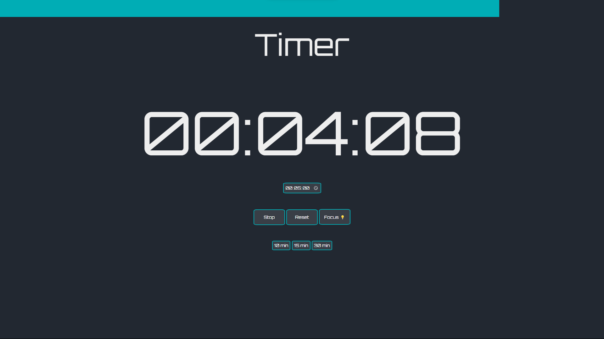

# Timer App

## Description

I've created a timer app using vanilla JavaScript, CSS, and HTML. The app features a sleek and aesthetic timer design.

## Features

- Simple and intuitive user interface.
- Aesthetically pleasing timer design.

## Technologies Used

- **JavaScript:** The core programming language for the app logic.
- **CSS:** Styling to enhance the visual appeal.
- **HTML:** Structuring the content and layout.

## How to Use

1. Clone this repository:

    ```bash
    git clone https://github.com/roshan21k/timer/
    ```

2. Open the `index.html` file in your web browser.

3. Use the timer for your desired purposes.

Feel free to explore and enjoy the simplicity and aesthetics of the timer app!

## Link

[Timer APP](https://roshan21k.github.io/timer/)

## Screenshots



## License

This project is open-source and available under the [MIT License](LICENSE).
